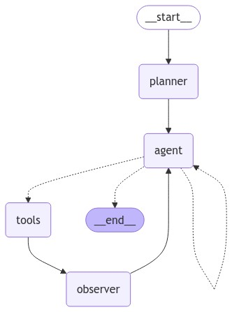

# ReAct Agent

This FastAPI codebase contains the code to create a ReAct Agent application with LangGraph.

This is a tool-calling ReAct agent powered with LLMs from Anthropic and OpenAI.

## Demo

<!-- 

  

 -->

## Contents

- [ReAct Agent](#react-agent)
  - [Demo](#demo)
  - [Contents](#contents)
  - [Architecture](#architecture)
  - [Prerequisites](#prerequisites)
  - [Base Tools](#base-tools)
  - [Contact](#contact)

## Architecture

  

## Prerequisites

**_Required:_**

- A watsonx.ai instance with API credentials
- Python 3.11 or higher

**_Optional:_**

- Mongo database (for persisting conversation threads across sessions/multiple API instances, conversation stored in API state otherwise)
- Milvus database (for RAG tool)
- Tavily API key (for enhanced search capabilities)
  - You can sign up for a Tavily API key at [https://tavily.com/](https://tavily.com/)
- Other API keys (for tools you may want to add)
  
## Base Tools

| Tool | Description | Example |
|------|-------------|---------|
| **Search**   | The Search tool allows the agent to perform web searches directly from the application. It can be used to find information, articles, or any other content available on the web. | `Search("latest news on AI")` |
| **Calculator** | The Calculator tool allows the agent to perform basic arithmetic operations directly within the application. | `Calculator("2 + 2")` |
| **Python REPL** | The Python REPL tool allows the agent to execute Python code snippets directly within the application. It can be used for quick calculations, data manipulation, or any other Python code execution. | `PythonREPL("print('Hello, World!')")` |
| **DateTime** | The Date/Time tool allows the agent to get the current date and time. | `DateTime()` |
| **Get Context** | This is a RAG tool allows the agent to query a Milvus database for context about the users query. This tool requires valid connection variables in the environment to a Milvus database with data loaded into it. | `GetContext("When was NASA established?")` |

## Contact

Please reach out to <james@heavey.net> with any questions or issues.
